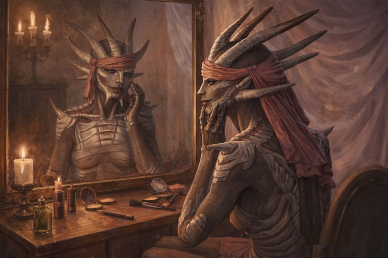

# Kenshi Compact

It's an apocalyptic world where you can't climb an inch on Maslow's Heirchy of Needs. You're starving, penniless, and constantly being chased by bandits. In a world like that the solution is clear... more vanity.

Have you ever been crawling your way from Bast to Stoat, because a pack of Skimmers didn't like the way you interupted their patrol? And while dragging the ravaged tendrils of your once beautiful legs, hoping against hope that the bartender in Stoat will have a `First Aid Kit` for sale, you think to yourself *I hate my cheekbones*? Then Kenshi-Compact is for you.

I love Kenshi, but as much as I enjoy playing the game, I love adjusting my character's look... constantly. So I created this mod in order to access the Character Editor anytime. Thought I'd share it in case anyone else is obsessed with sliders.

This mod is very simple. It opens the Character Editor anytime during gameplay, with the exception of during active combat. There are no gameplay enhancements or modifications, you just get to play the `one more change` game with any of your active characters.

